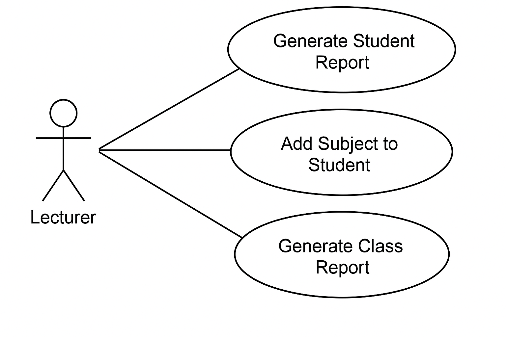

<h1>📘Student Performance System</h1> <br>

<h2>🔍 Overview</h2>

<br>
The Student Performance System is a C# console application that manages and reports on student academic data. It demonstrates object-oriented principles including encapsulation, inheritance, composition, and polymorphism. It consists of three main classes:

- **Person**: Base class for individuals  
- **Student**: Inherits from Person, adding student-specific attributes  
- **Subject**: Represents academic subjects with associated marks  

---

## 📚 Class Descriptions

### 👤 <u>Person Class</u>
- **Location**: `person.cs`  
- **Namespace**: `StudentPerformanceSystem.Models`  

#### 🔍 Description
Serves as the base class for representing individuals in the system.

#### 🧬 Fields
<ul>
  <li><code>name</code> (private string): The person's name</li>
  <li><code>age</code> (private int): The person's age</li>
</ul>

#### 🛠️ Constructors
- `Person(string name, int age)`: Initializes a new Person with the specified name and age

#### 🧪 Methods
<ul>
  <li><code>GetName()</code>: Returns the person's name</li>
  <li><code>SetName(string name)</code>: Updates the person's name</li>
  <li><code>GetAge()</code>: Returns the person's age</li>
  <li><code>SetAge(int age)</code>: Updates the person's age</li>
  <li><code>PrintDescription()</code>: Displays basic information (virtual method)</li>
</ul>

---

### 🎓 <u>Student Class</u>
- **Location**: `students.cs`  
- **Namespace**: `StudentPerformanceSystem.Models`  

#### 🔍 Description
Inherits from the Person class, representing a student with academic information.

#### 🧬 Fields
<ul>
  <li><code>studentNumber</code> (private string): Unique identifier for the student</li>
  <li><code>averageMark</code> (private float): Student's academic average</li>
  <li><code>subjects</code> (private List&lt;Subject&gt;): Collection of enrolled subjects</li>
</ul>

#### 🛠️ Constructors
- `Student(string name, int age, string studentNumber, float averageMark)`

#### 🧪 Methods
<ul>
  <li><code>AddSubject(Subject subject)</code>: Adds a subject</li>
  <li><code>GetStudentNumber()</code>: Returns student number</li>
  <li><code>SetStudentNumber(string number)</code>: Updates student number</li>
  <li><code>GetAverageMark()</code>: Returns average mark</li>
  <li><code>SetAverageMark(float newMark)</code>: Updates average mark</li>
  <li><code>PrintDescription()</code>: Overrides Person's method</li>
</ul>

---

### 📘 <u>Subject Class</u>
- **Location**: `Subject.cs`  
- **Namespace**: `StudentPerformanceSystem.Models`  

#### 🔍 Description
Represents an academic subject with associated marks.

#### 🧬 Properties
<ul>
  <li><code>SubjectName</code> (public string)</li>
  <li><code>SubjectCode</code> (public string)</li>
  <li><code>Marks</code> (public float)</li>
</ul>

#### 🛠️ Constructors
- `Subject(string subjectName, string subjectCode, float marks)`

---

### 🖥️ <u>Program Class</u>
- **Location**: Main program file  
- **Namespace**: `StudentPerformanceSystem`  

#### 🔍 Description
Contains the application's entry point and demonstrates how to use the classes.

#### 🧪 Methods
- `Main(string[] args)`: Entry point of the application

---

## 🔗 Class Relationships

### 📥 Inheritance
- `Student` inherits from `Person`
  - A `Student` is a specialized `Person`
  - Uses **polymorphism** with `PrintDescription()` override

### 🧩 Composition
- `Student` contains multiple `Subject` objects
  - Use `AddSubject()` to enroll in new subjects

---

## 💻 Code Examples

### ✅ Creating a Student
```csharp```
Student student = new Student("Zama", 25, "12345678", 76.8f);

---


## Object-Oriented Principles <br>
<table>
  <thead>
    <tr>
      <th colspan="2">🧠 Object-Oriented Principles</th>
    </tr>
    <tr>
      <th>Principle</th>
      <th>Usage</th>
    </tr>
  </thead>
  <tbody>
    <tr>
      <td>Encapsulation</td>
      <td>Private fields with public getters/setters</td>
    </tr>
    <tr>
      <td>Inheritance</td>
      <td><code>Student : Person</code></td>
    </tr>
    <tr>
      <td>Composition</td>
      <td><code>Student</code> has a list of <code>Subject</code> objects</td>
    </tr>
    <tr>
      <td>Polymorphism</td>
      <td>Overridden <code>PrintDescription()</code> method in <code>Student</code> class</td>
    </tr>
  </tbody>
</table>

--- 

## Use Cases and Scenarios <br>
<table>
  <thead>
    <tr>
      <th colspan="3">✅ Use Cases and Scenarios</th>
    </tr>
  </thead>
  <tbody>
    <tr>
      <td colspan="3"><strong>Use Case 1: Add a Subject to a Student</strong></td>
    </tr>
    <tr>
      <td><strong>Actor</strong>:</td>
      <td colspan="2">Admin/User</td>
    </tr>
    <tr>
      <td><strong>Goal</strong>:</td>
      <td colspan="2">Assign a new subject with marks to a student.</td>
    </tr>
    <tr>
      <td><strong>Scenario</strong>:</td>
      <td colspan="2">
        1. User creates or selects a student.<br>
        2. User inputs subject name, code, and marks.<br>
        3. System adds the subject to the student's subject list.
      </td>
    </tr>
    <tr>
      <td colspan="3"><strong>Use Case 2: Generate Student Report</strong></td>
    </tr>
    <tr>
      <td><strong>Actor</strong>:</td>
      <td colspan="2">Admin/User</td>
    </tr>
    <tr>
      <td><strong>Goal</strong>:</td>
      <td colspan="2">View a single student's performance.</td>
    </tr>
    <tr>
      <td><strong>Scenario</strong>:</td>
      <td colspan="2">
        1. User selects a student.<br>
        2. System displays name, student number, average mark, and subjects.
      </td>
    </tr>
    <tr>
      <td colspan="3"><strong>Use Case 3: Generate Class Report</strong></td>
    </tr>
    <tr>
      <td><strong>Actor</strong>:</td>
      <td colspan="2">Admin/User</td>
    </tr>
    <tr>
      <td><strong>Goal</strong>:</td>
      <td colspan="2">View all students and calculate class average.</td>
    </tr>
    <tr>
      <td><strong>Scenario</strong>:</td>
      <td colspan="2">
        1. User triggers report generation.<br>
        2. System loops through all students and calculates average.
      </td>
    </tr>
  </tbody>
</table>
<br><br>

# Below is a screenshot showing how student information and subjects are managed:


---

## Design Patterns Used

Encapsulation: Private fields with public getters/setters <br>
Inheritance: Student extends Person <br>
Polymorphism: Method overriding with PrintDescription()
---

## 🧑‍💻 Author
### Naluthabo Halalisani Sibisi


